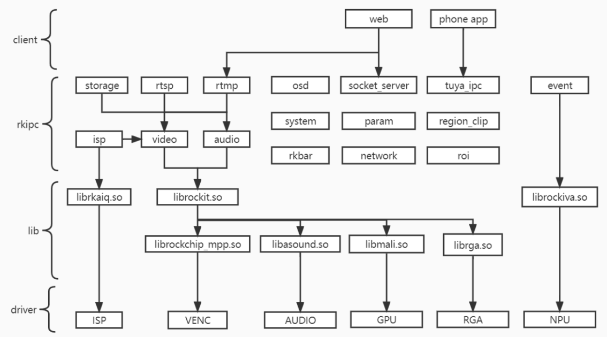
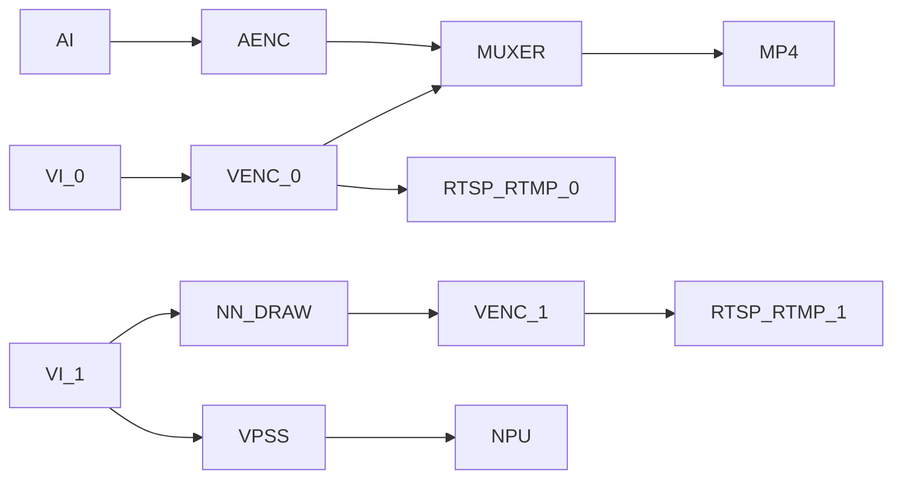
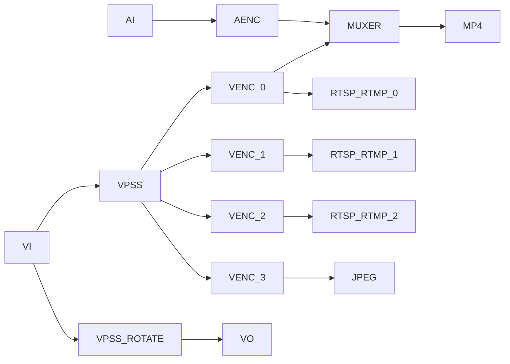
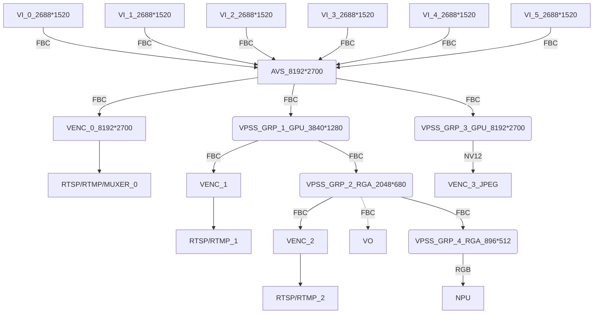
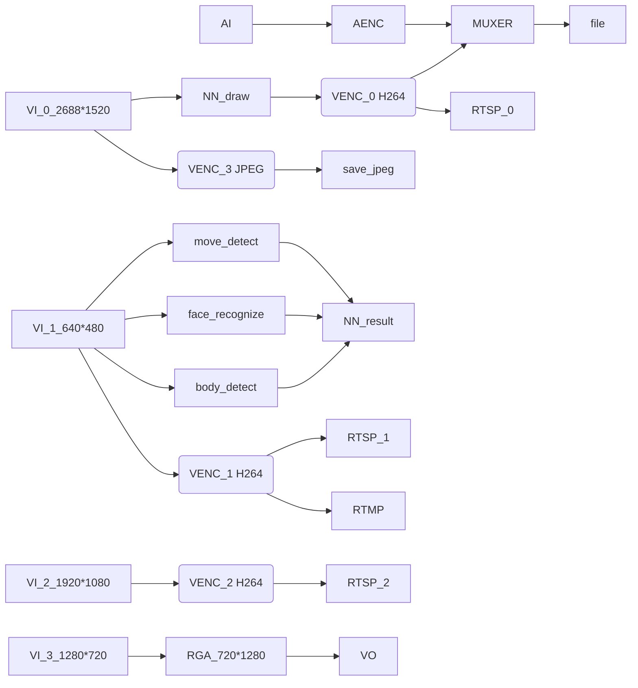
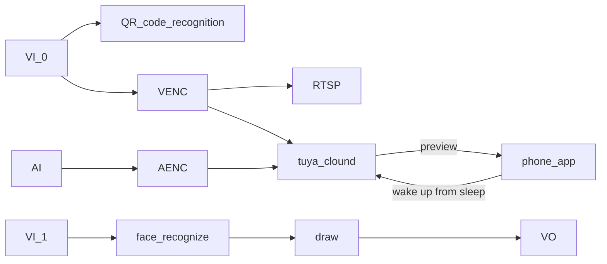
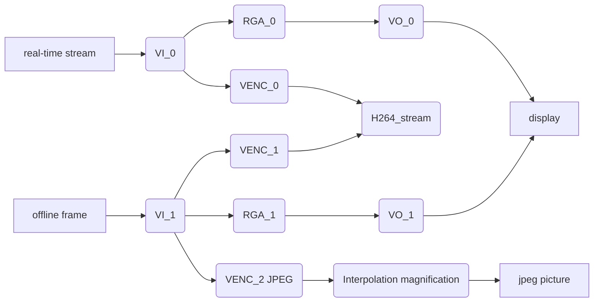

# Rockchip rkipc应用开发说明

文件标识：TODO

发布版本：V0.6.0

日期：2022-02-21

文件密级：□绝密   □秘密   □内部资料   ■公开

**免责声明**

本文档按“现状”提供，瑞芯微电子股份有限公司（“本公司”，下同）不对本文档的任何陈述、信息和内容的准确性、可靠性、完整性、适销性、特定目的性和非侵权性提供任何明示或暗示的声明或保证。本文档仅作为使用指导的参考。

由于产品版本升级或其他原因，本文档将可能在未经任何通知的情况下，不定期进行更新或修改。

**商标声明**

“Rockchip”、“瑞芯微”、“瑞芯”均为本公司的注册商标，归本公司所有。

本文档可能提及的其他所有注册商标或商标，由其各自拥有者所有。

**版权所有 © 2021瑞芯微电子股份有限公司**

超越合理使用范畴，非经本公司书面许可，任何单位和个人不得擅自摘抄、复制本文档内容的部分或全部，并不得以任何形式传播。

瑞芯微电子股份有限公司

Rockchip Electronics Co., Ltd.

地址：     福建省福州市铜盘路软件园A区18号

网址：     [www.rock-chips.com](http://www.rock-chips.com)

客户服务电话： +86-4007-700-590

客户服务传真： +86-591-83951833

客户服务邮箱： [fae@rock-chips.com](mailto:fae@rock-chips.com)

---

**前言**

**概述**

本文档提供RKIPC应用开发说明。

**产品版本**

| **芯片名称**         | **内核版本**    |
| -------------------- | --------------- |
| RV1126/RV1109/RK3588 | Linux 4.19/5.10 |

**读者对象**

本文档（本指南）主要适用于以下工程师：

技术支持工程师

软件开发工程师

**修订记录**

| **版本号** | **作者** | **修改日期** | **修改说明**           |
| ---------- | -------- | :----------- | ---------------------- |
| V0.1.0     | 林刘迪铭 | 2021-09-23   | 初始版本               |
| V0.2.0     | 林刘迪铭 | 2021-10-23   | 增加模块API介绍        |
| V0.3.0     | 林刘迪铭 | 2021-11-12   | 增加媒体流框图说明     |
| V0.4.0     | 林刘迪铭 | 2022-01-14   | 增加isp模块API介绍     |
| V0.5.0     | 林刘迪铭 | 2022-01-26   | 更新代码结构和产品类型 |
| V0.6.0     | 林刘迪铭 | 2022-02-21   | 更新RV1106信息         |

---

**目录**

[TOC]

---

## 整体框架



## 产品类型

| 源码目录           | 依赖外部库       | 功能                                                         |
| ------------------ | ---------------- | ------------------------------------------------------------ |
| rv1106_ipc         | rockit、rkaiq    | 针对rv1106平台的IPC产品，支持网页和rtsp/rtmp预览，参数动态修改。 |
| rk3588_ipc         | rockit、rkaiq    | 针对rk3588平台的单目IPC产品，支持网页和rtsp/rtmp预览，参数动态修改。 |
| rk3588_muliti_ipc  | rockit、rkaiq    | 针对rk3588平台的多目IPC产品，支持网页和rtsp/rtmp预览，参数动态修改。 |
| rv1126_ipc_rkmedia | rockit、rkaiq    | 针对rv1126/rv1109平台的IPC产品，使用rkmedia，支持网页和rtsp/rtmp预览，参数动态修改。 |
| rv1126_ipc_rockit  | easymedia、rkaiq | 针对rv1126/rv1109平台的IPC产品，使用rockit，支持网页和rtsp/rtmp预览，参数动态修改。 |
| rv1126_battery_ipc | rockit、rkaiq    | 针对rv1126/rv1109平台的电池类产品，支持涂鸦云手机APP预览，休眠唤醒功能。 |
| rv1126_snapshot    | easymedia、rkaiq | 针对rv1126/rv1109平台的抓拍类型产品，支持离线帧，本地拍照/录像，屏幕显示，插值放大(TODO)。 |

### RV1106 IPC



### RK3588 IPC



### RK3588 Multi-IPC



### RV1126 IPC Rkmedia



### RV1126 IPC Rockit


### RV1126 Battery IPC



### RV1126 Snapshot



## 代码结构

```shell
├── CMakeLists.txt
├── common # 通用模块
│   ├── common.h # 一些通用函数功能
│   ├── event # 事件处理模块：移动侦测，人脸人形识别
│   ├── isp # 图像处理模块
│   │   ├── rk3588
│   │   ├── rv1106
│   │   └── rv1126
│   ├── log.h # 日志管理
│   ├── network # 网络模块
│   ├── osd # OSD模块
│   │   ├── image.bmp # logo图片
│   │   └── simsun_en.ttf # 字体库
│   ├── param # 参数管理模块
│   ├── rkbar # 二维码识别模块
│   ├── rockiva # 周界算法模块
│   ├── rtmp # rtmp推流模块
│   ├── rtsp # rtsp推流模块
│   ├── storage # 存储模块
│   └── system # 系统管理模块
│   └── tuya_ipc # 涂鸦IPC模块
├── format.sh # 格式化脚本
├── lib # 存放32/64位版本，不同工具链的预编译库
│   ├── aarch64-rockchip1031-linux-gnu
│   └── arm-rockchip830-linux-gnueabihf
├── LICENSE # 版权声明
└── src
    ├── low_memory_ipc
    ├── rk3588_ipc
    │   ├── audio # 音频业务逻辑
    │   ├── CMakeLists.txt
    │   ├── main.c
    │   ├── rkipc.ini # 参数文件
    │   ├── server # socket服务端
    │   └── video # 视频业务逻辑
    │       ├── video.c
    │       └── video.h
    ├── rk3588_muliti_ipc
    ├── rv1126_battery_ipc
    ├── rv1126_ipc_rkmedia
    ├── rv1126_ipc_rockit
    └── rv1126_snapshot
```

## 开发原则

0、**纯C实现**，之前用C++的都要改写为C。

1、**模块化**，main函数越简单越好，只调用各个模块的init和deinit函数。各个模块功能自己管理，差异化部分由注册回调函数实现。

2、**参数管理使用iniparser**，不做复杂封装，各个模块自行决定哪些参数在何时读写ini。

3、**log统一使用common/log.h。**

4、能通用的尽量放到common中，如果由于平台差异和业务逻辑无法通用，则每个src目录都放一份，避免加平台宏判断。

5、优先使用源码编译，其次使用静态库，最后才是选择用动态库。


## 新增参数开发流程

**web前端→web后端→rkipc→底层模块→保存参数**

以色调为例，前端基本已经实现不用改，web后端在app/ipcweb-backend/src/image_api.cpp里会收到"iHue":50，这样的json字符串。

然后调用app/ipcweb-backend/src/socket_client里封装好的函数，远程调用到rkipc中。

rkipc也要在app/rkipc/src/server中封装对应的函数，来进行设置生效并保存。

**建议新增函数时按get/set成对增加。**

rkipc主要封装函数供外部调用，以及初始化时设置。

举例如下:

### ini文件新增hue字段：

```ini
[isp.0.adjustment]
hue = 50
```

### isp模块新增set/get函数

```c
diff --git a/src/isp/isp.c b/src/isp/isp.c
index e59fdd3..7877ae9 100644
--- a/src/isp/isp.c
+++ b/src/isp/isp.c
@@ -165,6 +165,22 @@ int rk_isp_set_sharpness(int cam_id, int value) {
   return ret;
 }
 
+int rk_isp_get_hue(int cam_id, int *value) {
+  RK_ISP_CHECK_CAMERA_ID(cam_id);
+  int ret = rk_aiq_uapi_getHue(g_aiq_ctx[cam_id], value);
+  *value = (int)(*value / 2.55);
+
+  return ret;
+}
+
+int rk_isp_set_hue(int cam_id, int value) {
+  RK_ISP_CHECK_CAMERA_ID(cam_id);
+  int ret = rk_aiq_uapi_setHue(g_aiq_ctx[cam_id], (int)(value * 2.55)); // value[0,255]
+  rk_param_set_int("isp.0.adjustment:hue", value);
+
+  return ret;
+}
+
 // exposure
 // night_to_day
 // blc
@@ -180,6 +196,7 @@ int rk_isp_set_from_ini(int cam_id) {
   rk_isp_set_brightness(cam_id, iniparser_getint(g_ini_d_, "isp.0.adjustment:brightness", 50));
   rk_isp_set_saturation(cam_id, iniparser_getint(g_ini_d_, "isp.0.adjustment:saturation", 50));
   rk_isp_set_sharpness(cam_id, iniparser_getint(g_ini_d_, "isp.0.adjustment:sharpness", 50));
+  rk_isp_set_hue(cam_id, iniparser_getint(g_ini_d_, "isp.0.adjustment:hue", 50));
   LOG_INFO("end\n");
 
   return ret;
diff --git a/src/isp/isp.h b/src/isp/isp.h
index e77c9fc..0d3835a 100644
--- a/src/isp/isp.h
+++ b/src/isp/isp.h
@@ -9,4 +9,6 @@ int rk_isp_get_saturation(int cam_id, int *value);
 int rk_isp_set_saturation(int cam_id, int value);
 int rk_isp_get_sharpness(int cam_id, int *value);
 int rk_isp_set_sharpness(int cam_id, int value);
+int rk_isp_get_hue(int cam_id, int *value);
+int rk_isp_set_hue(int cam_id, int value);
 // exposure
```

### server模块封装socket函数

```c
diff --git a/src/server/server.c b/src/server/server.c
index 6613b90..52692c9 100644
--- a/src/server/server.c
+++ b/src/server/server.c
@@ -236,6 +236,40 @@ int ser_rk_isp_set_sharpness(int fd) {
   return 0;
 }
 
+int ser_rk_isp_get_hue(int fd) {
+  int err = 0;
+  int cam_id;
+  int value;
+
+  if (sock_read(fd, &cam_id, sizeof(cam_id)) == SOCKERR_CLOSED)
+    return -1;
+  err = rk_isp_get_hue(cam_id, &value);
+  LOG_DEBUG("value is %d\n", value);
+  if (sock_write(fd, &value, sizeof(value)) == SOCKERR_CLOSED)
+    return -1;
+  if (sock_write(fd, &err, sizeof(int)) == SOCKERR_CLOSED)
+    return -1;
+
+  return 0;
+}
+
+int ser_rk_isp_set_hue(int fd) {
+  int err = 0;
+  int cam_id;
+  int value;
+
+  if (sock_read(fd, &cam_id, sizeof(cam_id)) == SOCKERR_CLOSED)
+    return -1;
+  if (sock_read(fd, &value, sizeof(value)) == SOCKERR_CLOSED)
+    return -1;
+  LOG_DEBUG("value is %d\n", value);
+  err = rk_isp_set_hue(cam_id, value);
+  if (sock_write(fd, &err, sizeof(int)) == SOCKERR_CLOSED)
+    return -1;
+
+  return 0;
+}
+
 static const struct FunMap map[] = {
     {(char *)"rk_isp_set", &ser_rk_isp_set},
     {(char *)"rk_video_set", &ser_rk_video_set},
@@ -247,7 +281,9 @@ static const struct FunMap map[] = {
     {(char *)"rk_isp_get_saturation", &ser_rk_isp_get_saturation},
     {(char *)"rk_isp_set_saturation", &ser_rk_isp_set_saturation},
     {(char *)"rk_isp_get_sharpness", &ser_rk_isp_get_sharpness},
-    {(char *)"rk_isp_set_sharpness", &ser_rk_isp_set_sharpness}
+    {(char *)"rk_isp_set_sharpness", &ser_rk_isp_set_sharpness},
+    {(char *)"rk_isp_get_hue", &ser_rk_isp_get_hue},
+    {(char *)"rk_isp_set_hue", &ser_rk_isp_set_hue}
 };
 
 static void *rec_thread(void *arg) {
```

### web后端新增相关判断

ipcweb-backend主要判断web前端传入的数据，进而Get/Set数据，修改如下

```c++
diff --git a/src/image_api.cpp b/src/image_api.cpp
index 475e17d..edac2de 100644
--- a/src/image_api.cpp
+++ b/src/image_api.cpp
@@ -20,15 +20,17 @@ nlohmann::json image_specific_resource_get(std::string string) {
       nlohmann::json::object(); /* one of all the same resources */
   minilog_debug("%s: string is %s\n", __func__, string.c_str());
   if (!string.compare(PATH_IMAGE_ADJUSTMENT)) {
-    int brightness, contrast, saturation, sharpness;
+    int brightness, contrast, saturation, sharpness, hue;
     rk_isp_get_brightness(0, &brightness);
     rk_isp_get_contrast(0, &contrast);
     rk_isp_get_saturation(0, &saturation);
     rk_isp_get_sharpness(0, &sharpness);
+    rk_isp_get_hue(0, &hue);
     specific_resource.emplace("iBrightness", brightness);
     specific_resource.emplace("iContrast", contrast);
     specific_resource.emplace("iSaturation", saturation);
     specific_resource.emplace("iSharpness", sharpness);
+    specific_resource.emplace("iHue", hue);
   } else if (!string.compare(PATH_IMAGE_EXPOSURE)) {

   } else if (!string.compare(PATH_IMAGE_NIGHT_TO_DAY)) {
@@ -84,6 +86,10 @@ void image_specific_resource_set(std::string string, nlohmann::json data) {
       value = atoi(data.at("iSharpness").dump().c_str());
       rk_isp_set_sharpness(0, value);
     }
+    if (data.dump().find("iHue") != data.dump().npos) {
+      value = atoi(data.at("iHue").dump().c_str());
+      rk_isp_set_hue(0, value);
+    }
   } else if (!string.compare(PATH_IMAGE_EXPOSURE)) {

   } else if (!string.compare(PATH_IMAGE_NIGHT_TO_DAY)) {
diff --git a/src/socket_client/client.cpp b/src/socket_client/client.cpp
index 448e847..7f84b4f 100644
--- a/src/socket_client/client.cpp
+++ b/src/socket_client/client.cpp
@@ -182,4 +182,36 @@ int rk_isp_set_sharpness(int cam_id, int value) {
   cli_end(fd);

   return ret;
 }
+
+int rk_isp_get_hue(int cam_id, int *value) {
+  int fd;
+  int ret = 0;
+
+  fd = cli_begin((char *)__func__);
+  /* Transmission parameters */
+  sock_write(fd, &cam_id, sizeof(cam_id));
+  sock_read(fd, value, sizeof(value));
+
+  sock_read(fd, &ret, sizeof(ret));
+  /* End transmission parameters */
+  cli_end(fd);
+
+  return ret;
+}
+
+int rk_isp_set_hue(int cam_id, int value) {
+  int fd;
+  int ret = 0;
+
+  fd = cli_begin((char *)__func__);
+  /* Transmission parameters */
+  sock_write(fd, &cam_id, sizeof(cam_id));
+  sock_write(fd, &value, sizeof(value));
+
+  sock_read(fd, &ret, sizeof(ret));
+  /* End transmission parameters */
+  cli_end(fd);
+
+  return ret;
+}
diff --git a/src/socket_client/client.h b/src/socket_client/client.h
index 11fdd1c..0c09913 100644
--- a/src/socket_client/client.h
+++ b/src/socket_client/client.h
@@ -8,4 +8,6 @@ int rk_isp_set_brightness(int cam_id, int value);
 int rk_isp_get_saturation(int cam_id, int *value);
 int rk_isp_set_saturation(int cam_id, int value);
 int rk_isp_get_sharpness(int cam_id, int *value);
 int rk_isp_set_sharpness(int cam_id, int value);
+int rk_isp_get_hue(int cam_id, int *value);
+int rk_isp_set_hue(int cam_id, int value);
\ No newline at end of file
```

### web前端新增相关判断

web前端修改html和ts文件，新增选项布局和get/set。

代码可参考app/ipcweb-ng/src/app/config/shared/isp中的html和ts，主要部分如下：

```html
<form class="form" [formGroup]="imageForm">
      <div id=ispGrp role="tablist">
        <div class="card" *ngFor="let cardTitle of cardList">
          <div id="ispGrp1Header" class="card-header" (click)="onSelectCard(cardTitle)">
            <label>{{ groupNameDict[cardTitle] | translate }}</label>
          </div>
          <div class="card-body card-block form-group" [id]="cardTitle" [formGroupName]="groupNameDict[cardTitle]">
            <ng-container *ngIf="capDict[cardTitle][layoutKey]">
              <ng-container *ngFor="let layoutItem of capDict[cardTitle][layoutKey][cardTitle]">
                <div class="form-row my-1" *ngIf="checkType(capDict[cardTitle][pageLayoutKey][layoutItem], 'range')">
                  <label class="col-3">{{ transferControlName(layoutItem) | translate }}</label>
                  <input class="col-6 custom-range" [formControlName]="layoutItem" type="range" (ngModelChange)="onRangeChange($event, cardTitle, layoutItem)" (mouseup)="onSubmitPart(cardTitle, layoutItem, 'range')" [min]="getRange(capDict[cardTitle][pageLayoutKey][layoutItem], 'min')" [max]="getRange(capDict[cardTitle][pageLayoutKey][layoutItem], 'max')" [step]="getRange(capDict[cardTitle][pageLayoutKey][layoutItem], 'step')">
                  <input class="col-2 form-control" [formControlName]="layoutItem" type="number" (ngModelChange)="onRangeChange($event, cardTitle, layoutItem)" (blur)="onSubmitPart(cardTitle, layoutItem, 'number')" [id]="layoutItem">
                  <label class="alarm-tip pat1" *ngIf="imageForm.get(groupNameDict[cardTitle]).get(layoutItem).errors?.min || imageForm.get(groupNameDict[cardTitle]).get(layoutItem).errors?.max || imageForm.get(groupNameDict[cardTitle]).get(layoutItem).errors?.isNumberJudge">{{'ranges' | translate}}({{getRange(capDict[cardTitle][pageLayoutKey][layoutItem], 'min')}}~{{getRange(capDict[cardTitle][pageLayoutKey][layoutItem], 'max')}})</label>
                </div>
                <div class="form-row my-1" *ngIf="checkType(capDict[cardTitle][pageLayoutKey][layoutItem], 'options') && isItemEnable(layoutItem)">
                  <label class="col-3 form-group-text mt-1">{{ transferControlName(layoutItem) | translate }}</label>
                  <select class="custom-select col-md-8" [formControlName]="layoutItem" (ngModelChange)="updateDynamicCap(cardTitle, layoutItem, $event)" [id]="layoutItem">
                    <option *ngFor="let opItem of htmlOptionFilter(layoutItem, capDict[cardTitle][pageLayoutKey][layoutItem]['options'])" [value]="opItem">{{ htmlOptionTransfer(layoutItem, opItem) | translate }}</option>
                  </select>
                </div>
                <div class="form-row my-1" *ngIf="checkType(capDict[cardTitle][pageLayoutKey][layoutItem], 'input') && capDict[cardTitle][pageLayoutKey][layoutItem]['input']==='time'">
                  <label class="col-3">{{ transferControlName(layoutItem) | translate }}</label>
                  <input type="time" step=1 [formControlName]="layoutItem" (blur)="onSubmitPart(cardTitle, layoutItem, 'time')" [id]="layoutItem">
                </div>
              </ng-container>
            </ng-container>
          </div>
        </div>
      </div>
    </form>
```

```typescript
imageForm = this.fb.group({
    id: [''],
    imageAdjustment: this.fb.group({
      iBrightness: [''],
      iContrast: [''],
      iSaturation: [''],
      iSharpness: [''],
      iHue: ['']
    })
});

get imageAdjustment(): FormGroup {
    return this.imageForm.get('imageAdjustment') as FormGroup;
}

submitOne(groupName: string, isReboot: boolean = false, isAppRestart = false) {
    if (!this.isInit || this.lock.checkLock('submitOne')) {
      return;
    }
    this.lock.lock('submitOne');
    this.pfs.formatInt(this.imageForm.value[groupName]);
    const path = this.group2path[groupName];
    this.cfgService.setImageInterfacePart(this.imageForm.value[groupName], path, this.imageForm.value['id']).subscribe(
      res => {
        this.resError.analyseRes(res, 'saveFail');
        this.setAlarmTip(res, groupName);
        this.imageForm.get(groupName).patchValue(res);
        if (isReboot) {
          this.tips.setCTPara('restart');
        } else if (isAppRestart) {
          this.tips.setRbTip('appRestart');
        } else {
          this.tips.showSaveSuccess();
        }
        this.lock.unlock('submitOne');
      },
      err => {
        if (isReboot) {
          this.tips.setCTPara('close');
        }
        this.tips.showSaveFail();
        this.lock.unlock('submitOne');
      }
    );
  }
```

## 模块API介绍

### 网络模块

| 函数名称                        | 功能                      |
| ------------------------------- | ------------------------- |
| rk_network_init                 | 网络模块初始化            |
| rk_network_deinit               | 网络模块反初始化          |
| rk_network_ipv4_set             | 设置IPv4                  |
| rk_network_ipv4_get             | 获取IPv4配置              |
| rk_network_dns_get              | 取得当前有线网卡使用的dns |
| rk_network_dns_set              | 设置当前有线网卡使用的dns |
| rk_network_get_mac              | 获取设备MAC地址           |
| rk_network_set_mac              | 设置设备MAC地址           |
| rk_network_nicspeed_get         | 获取网卡速率              |
| rk_network_nicspeed_set         | 设置网卡速率              |
| rk_network_nicspeed_support_get | 获取网卡支持速率          |
| rk_ethernet_power_set           | 开关以太网                |
| rk_nic_state_get                | 取得当前网卡状态          |
| rk_wifi_power_get               | 获取当前wifi状态          |
| rk_wifi_power_set               | 开关wifi                  |
| rk_wifi_scan_wifi               | 立即扫描wifi              |
| rk_wifi_get_list                | 获取wifi列表              |
| rk_wifi_connect_with_ssid       | 连接wifi                  |
| rk_wifi_forget_with_ssid        | 删除wifi                  |

### 封装模块

| 函数名称                  | 功能             |
| ------------------------- | ---------------- |
| rkmuxer_init              | 封装模块初始化   |
| rkmuxer_deinit            | 封装模块反初始化 |
| rkmuxer_write_video_frame | 视频帧写入       |
| rkmuxer_write_audio_frame | 音频帧写入       |

### 存储模块

| 函数名称                     | 功能             |
| ---------------------------- | ---------------- |
| rk_storage_init              | 存储模块初始化   |
| rk_storage_deinit            | 存储模块反初始化 |
| rk_storage_write_video_frame | 视频帧写入       |
| rk_storage_write_audio_frame | 音频帧写入       |
| rk_storage_record_start      | 录像开始         |
| rk_storage_record_stop       | 录像停止         |
| rk_storage_record_status_get | 录像状态获取     |

### OSD模块

由于rkmedia和rockit库中，对OSD的具体实现方式不一样，为了使OSD模块业务逻辑抽象化，和video模块解耦合，使用了回调函数注册的方式。

通过注册相关函数，可以采用不同的实现，而上层逻辑保持相同。

| 函数名称                               | 功能                   |
| -------------------------------------- | ---------------------- |
| rk_osd_cover_create_callback_register  | 创建遮罩的回调函数注册 |
| rk_osd_cover_destroy_callback_register | 销毁遮罩的回调函数注册 |
| rk_osd_bmp_create_callback_register    | 创建bmp的回调函数注册  |
| rk_osd_bmp_destroy_callback_register   | 销毁bmp的回调函数注册  |
| rk_osd_bmp_change_callback_register    | 更改bmp的回调函数注册  |
| rk_osd_init                            | osd模块初始化          |
| rk_osd_deinit                          | osd模块反初始化        |
| rk_osd_restart                         | osd模块重启            |
| fill_image                             | 填充图像               |
| fill_text                              | 生成文字图像并填充     |
| generate_date_time                     | 生成宽字符型时间戳     |
| rk_osd_get_font_size                   | 获取字体大小           |
| rk_osd_set_font_size                   | 设置字体大小           |
| rk_osd_get_font_color                  | 获取字体颜色           |
| rk_osd_set_font_color                  | 设置字体颜色           |
| rk_osd_get_font_path                   | 获取字体文件路径       |
| rk_osd_set_font_path                   | 设置字体文件路径       |
| rk_osd_get_enabled                     | 获取使能状态           |
| rk_osd_set_enabled                     | 设置使能状态           |
| rk_osd_get_position_x                  | 获取横坐标             |
| rk_osd_set_position_x                  | 设置横坐标             |
| rk_osd_get_position_y                  | 获取纵坐标             |
| rk_osd_set_position_y                  | 设置纵坐标             |
| rk_osd_get_height                      | 获取高度               |
| rk_osd_set_height                      | 设置高度               |
| rk_osd_get_width                       | 获取宽度               |
| rk_osd_set_width                       | 设置宽度               |
| rk_osd_get_display_text                | 获取显示文本           |
| rk_osd_set_display_text                | 设置显示文本           |
| rk_osd_get_image_path                  | 获取图像文件路径       |
| rk_osd_set_image_path                  | 设置图像文件路径       |

### 系统模块

目前初始ini文件默认为/usr/share/rkipc.ini，启动脚本判断/userdata中无rkipc.ini时，会拷贝到其中。

恢复出厂设置时，会把/usr/share/rkipc.ini拷贝为/userdata/rkipc.ini。

| 函数名称                 | 功能             |
| ------------------------ | ---------------- |
| rk_system_init           | 系统模块初始化   |
| rk_system_deinit         | 系统模块反初始化 |
| rk_system_reboot         | 重启             |
| rk_system_factory_reset  | 恢复出厂设置     |
| rk_system_export_log     | 导出日志         |
| rk_system_export_db      | 导出配置文件     |
| rk_system_import_db      | 导入配置文件     |
| rk_system_upgrade        | 系统升级         |
| rk_system_get_user_num   | 获取用户数       |
| rk_system_set_user_num   | 设置用户数       |
| rk_system_get_user_level | 获取用户权限     |
| rk_system_set_user_level | 设置用户权限     |
| rk_system_get_user_name  | 获取用户名       |
| rk_system_set_user_name  | 设置用户名       |
| rk_system_get_password   | 获取密码(已加密) |
| rk_system_set_password   | 设置密码(已加密) |
| rk_system_add_user       | 新增用户         |
| rk_system_del_user       | 删除用户         |

### 事件模块

TODO

### rtmp推流模块

| 函数名称                  | 功能             |
| ------------------------- | ---------------- |
| rk_rtmp_init              | rtmp模块初始化   |
| rk_rtmp_deinit            | rtmp模块反初始化 |
| rk_rtmp_write_video_frame | 写视频帧         |
| rk_rtmp_write_audio_frame | 写音频帧         |

### rtsp推流模块

| 函数名称           | 功能              |
| ------------------ | ----------------- |
| create_rtsp_demo   | 创建句柄          |
| rtsp_new_session   | 根据URL，创建会话 |
| rtsp_set_video     | 设置视频流格式    |
| rtsp_set_audio     | 设置音频流格式    |
| rtsp_sync_video_ts | 同步视频时间戳    |
| rtsp_sync_audio_ts | 同步音频时间戳    |
| rtsp_del_session   | 删除会话          |
| rtsp_del_demo      | 删除句柄          |
| rtsp_tx_video      | 送视频帧          |
| rtsp_tx_audio      | 送音频帧          |
| rtsp_do_event      | 执行操作          |

### ISP模块

| 函数名称                             | 功能             |
| ------------------------------------ | ---------------- |
| rk_isp_init                          | 单摄像头初始化   |
| rk_isp_deinit                        | 单摄像头反初始化 |
| rk_isp_group_init                    | 多摄像头初始化   |
| rk_isp_group_deinit                  | 多摄像头反初始化 |
| rk_isp_set_frame_rate                | 设置帧率         |
| rk_isp_get_contrast                  | 获取对比度       |
| rk_isp_set_contrast                  | 设置对比度       |
| rk_isp_get_brightness                | 获取亮度         |
| rk_isp_set_brightness                | 设置亮度         |
| rk_isp_get_saturation                | 获取饱和度       |
| rk_isp_set_saturation                | 设置饱和度       |
| rk_isp_get_sharpness                 | 获取锐度         |
| rk_isp_set_sharpness                 | 设置锐度         |
| rk_isp_get_hue                       | 获取色调         |
| rk_isp_set_hue                       | 设置色调         |
| rk_isp_get_exposure_mode             | 获取曝光模式     |
| rk_isp_set_exposure_mode             | 设置曝光模式     |
| rk_isp_get_gain_mode                 | 获取增益模式     |
| rk_isp_set_gain_mode                 | 设置增益模式     |
| rk_isp_get_exposure_time             | 获取曝光时间     |
| rk_isp_set_exposure_time             | 设置曝光时间     |
| rk_isp_get_exposure_gain             | 获取增益         |
| rk_isp_set_exposure_gain             | 设置增益         |
| rk_isp_get_hdr                       | 获取高动态模式   |
| rk_isp_set_hdr                       | 设置高动态模式   |
| rk_isp_get_blc_region                | 获取背光模式     |
| rk_isp_set_blc_region                | 设置背光模式     |
| rk_isp_get_hlc                       | 获取强光抑制模式 |
| rk_isp_set_hlc                       | 设置强光抑制模式 |
| rk_isp_get_hdr_level                 | 获取高动态级别   |
| rk_isp_set_hdr_level                 | 设置高动态级别   |
| rk_isp_get_blc_strength              | 获取背光强度     |
| rk_isp_set_blc_strength              | 设置背光强度     |
| rk_isp_get_hlc_level                 | 获取强光抑制等级 |
| rk_isp_set_hlc_level                 | 设置强光抑制等级 |
| rk_isp_get_dark_boost_level          | 获取暗区增强等级 |
| rk_isp_set_dark_boost_level          | 设置暗区增强等级 |
| rk_isp_get_white_blance_style        | 获取白平衡模式   |
| rk_isp_set_white_blance_style        | 设置白平衡模式   |
| rk_isp_get_white_blance_red          | 获取白平衡R增益  |
| rk_isp_set_white_blance_red          | 设置白平衡R增益  |
| rk_isp_get_white_blance_green        | 获取白平衡G增益  |
| rk_isp_set_white_blance_green        | 设置白平衡G增益  |
| rk_isp_get_white_blance_blue         | 获取白平衡B增益  |
| rk_isp_set_white_blance_blue         | 设置白平衡B增益  |
| rk_isp_get_noise_reduce_mode         | 获取降噪模式     |
| rk_isp_set_noise_reduce_mode         | 设置降噪模式     |
| rk_isp_get_dehaze                    | 获取去雾模式     |
| rk_isp_set_dehaze                    | 设置去雾模式     |
| rk_isp_get_gray_scale_mode           | 获取灰度范围     |
| rk_isp_set_gray_scale_mode           | 设置灰度范围     |
| rk_isp_get_distortion_correction     | 获取畸变矫正模式 |
| rk_isp_set_distortion_correction     | 设置畸变矫正模式 |
| rk_isp_get_spatial_denoise_level     | 获取空域降噪等级 |
| rk_isp_set_spatial_denoise_level     | 设置空域降噪等级 |
| rk_isp_get_temporal_denoise_level    | 获取时域降噪等级 |
| rk_isp_set_temporal_denoise_level    | 设置时域降噪等级 |
| rk_isp_get_dehaze_level              | 获取去雾等级     |
| rk_isp_set_dehaze_level              | 设置去雾等级     |
| rk_isp_get_ldch_level                | 获取LDCH等级     |
| rk_isp_set_ldch_level                | 设置LDCH等级     |
| rk_isp_get_power_line_frequency_mode | 获取视频制式     |
| rk_isp_set_power_line_frequency_mode | 设置视频制式     |
| rk_isp_get_image_flip                | 获取镜像翻转     |
| rk_isp_set_image_flip                | 设置镜像翻转     |
| rk_isp_get_af_mode                   | 获取自动对焦模式 |
| rk_isp_set_af_mode                   | 设置自动对焦模式 |
| rk_isp_get_zoom_level                | 获取放大缩小等级 |
| rk_isp_set_zoom_level                | 设置放大缩小等级 |
| rk_isp_af_zoom_in                    | 放大             |
| rk_isp_af_zoom_out                   | 缩小             |
| rk_isp_af_focus_in                   | 聚焦             |
| rk_isp_af_focus_out                  | 失焦             |


### 参数管理模块

| 函数名称            | 功能                        |
| ------------------- | --------------------------- |
| rk_param_get_int    | 获取整型参数                |
| rk_param_set_int    | 设置整型参数                |
| rk_param_get_string | 获取字符型参数              |
| rk_param_set_string | 设置字符型参数              |
| rk_param_save       | 将当前参数保存为文件        |
| rk_param_init       | 从指定ini文件初始化         |
| rk_param_deinit     | 反初始化                    |
| rk_param_reload     | 不保存当前参数，重新加载ini |

